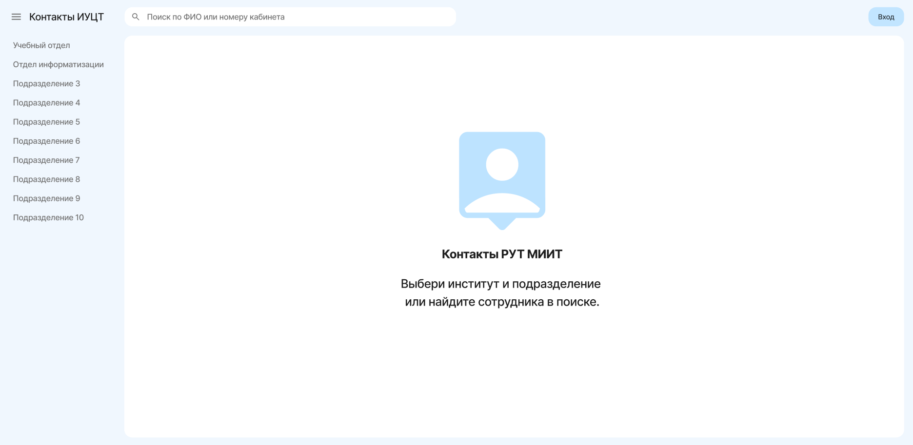
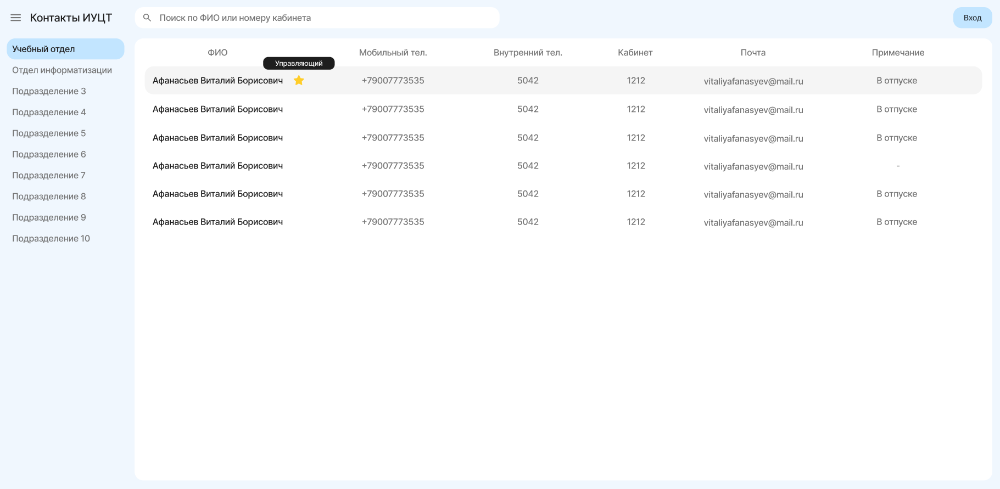
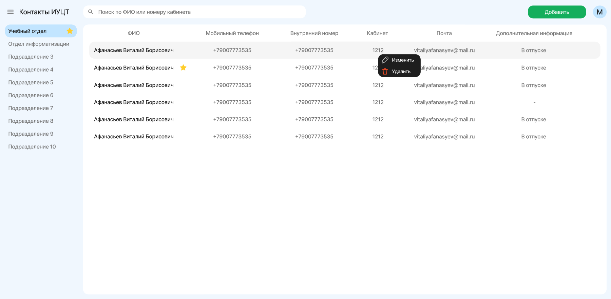
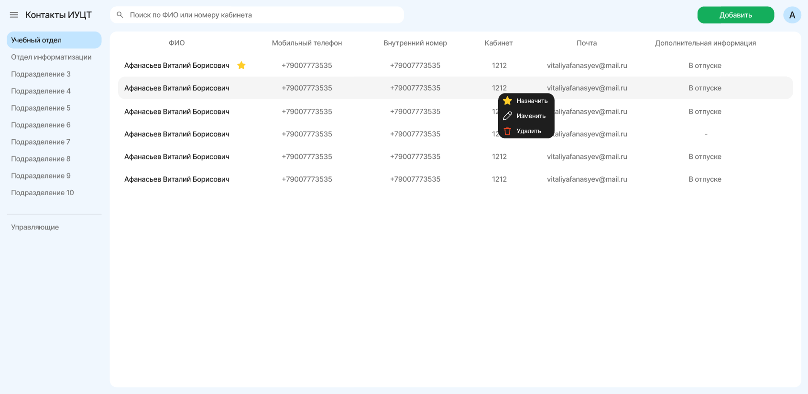

# Внутренний телефонный справочник ИУЦТ

**MIIT Contacts** — учебный проект в рамках университета, веб‑приложение для внутреннего телефонного справочника Института управления и цифровых технологий (ИУЦТ).  
Система позволяет сотрудникам быстро находить контакты коллег, а администраторам и менеджерам подразделений — поддерживать справочник в актуальном состоянии.

Проект реализован на **React** с использованием **React Router**, **MobX** и **Axios**, взаимодействует с REST API бэкенда и поддерживает ролевую модель доступа (администратор, менеджер подразделения, обычный пользователь).

## Основные возможности

### 🔎 Поиск и просмотр контактов
- Панель поиска по **ФИО** и **номеру кабинета**.
- Список подразделений в левой колонке; выбор подразделения подгружает контакты через API.
- Табличное отображение контактов:
  - ФИО  
  - мобильный телефон  
  - внутренний номер  
  - кабинет  
  - почта  
  - примечание / дополнительная информация

### 👤 Роли и права доступа

#### Обычный пользователь
- Просмотр структурированных контактных данных по подразделениям.
- Поиск сотрудников по ключевым полям.

#### Менеджер подразделения
- Авторизация через отдельную ссылку‑приглашение и страницу активации (задаёт пароль).  
- Может редактировать и удалять контакты **только своего подразделения**.
- Подразделение менеджера отмечено значком ⭐ в списке отделов.
- Контакт менеджера в списке сотрудников также помечен ⭐.

#### Администратор
- Имеет доступ ко всем подразделениям.
- Через контекстное меню строки контакта может:
  - **назначить менеджера** подразделения (отправить ссылку‑приглашение на почту),
  - **изменить** контакт,
  - **удалить** контакт.
- Отвечает за поддержку структуры подразделений и выдачу прав.

---

## Аутентификация и безопасность

- Форма входа с проверкой корректности email и длины пароля.
- Хранение сведений о пользователе в MobX‑сторе и localStorage для восстановления сессии.
- Поддержка страницы восстановления пароля (email‑сценарий может быть подключён на стороне бэкенда).
- Разделение интерфейса и функций в зависимости от роли (ADMIN / MANAGER / пользователь).

---

## Скриншоты интерфейса

### 1 — Стартовая страница (отдел не выбран)

---

### 2 — Выбран отдел, отображение списка контактов

---

### 3 — Интерфейс менеджера отдела
Менеджер видит своё подразделение со звёздочкой и может редактировать/удалять контакты в нём.

---

### 4 — Интерфейс администратора
Администратор дополнительно может назначать менеджера для контакта и управлять всеми записями.

---

## Назначение проекта

Проект разработан как **учебное задание в рамках университета** и демонстрирует:

- построение одностраничного приложения на React с маршрутизацией и управлением состоянием,
- работу с ролевой моделью доступа и разграничением прав в интерфейсе,
- интеграцию с REST API, загрузку данных по отделам и поиск по сотрудникам,
- реализацию удобного корпоративного интерфейса для внутреннего телефонного справочника.
